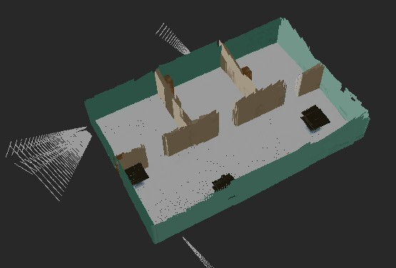
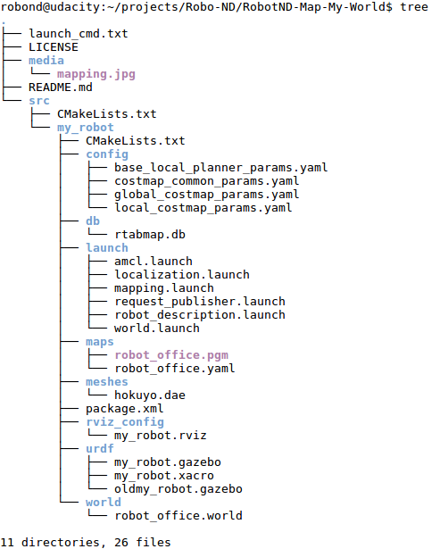

# Robotics : Map My World!
A robot maps its world using [RTAB-Map](http://wiki.ros.org/rtabmap_ros) (Real-Time Appearance-Based Mapping) is a popular solution for SLAM to develop robots that can map environments in 3D. A robot using SLAM to mapping a world. The program runs in the robot simulation [Gazebo](http://gazebosim.org/) and using the robot operating system [ROS]( https://www.ros.org/).
    
This project is part of my robotics nano degree of[ Udacity](https://www.udacity.com/course/robotics-software-engineer--nd209). 

### Example: A robot maps its world


<br>

## Important files
- /srcmy_robot/* : the robot and building model
- /src/rtabmap_ros* : the ROS package RTAB-Map
- /src/teleop_twist_keyboard/*: The ROS package to send movement commands to the robot via the keyboard.


### Project tree without rtabmap_ros and teleop_twist_keyboard
 

<br>
  
## Installation and usage
***The application runs on Ubuntu with ROS installed.***

Clone the repository
```sh
$ cd <your workspace folder>
$ git clone https://github.com/embmike/RobotND-Map-My-World.git
```
 
Build packages
```sh
$ cd /<your workspace folder>/RobotND-Map-My-World
$ catkin_make
```
 
Launch the robot inside the world and drive the robot
```sh
$ cd /<your workspace folder>/RobotND-Map-My-World
$ chmod +x cd mapping.sh
$ ./mapping.sh
```

Now use the keyboard to send movement commands to the robot to move the robot. 
The robor is mapping the world.
```sh
	---------------------------
	Moving around:
	   u    i    o
	   j    k    l
	   m    ,    .

	q/z : increase/decrease max speeds by 10%
	w/x : increase/decrease only linear speed by 10%
	e/c : increase/decrease only angular speed by 10%
	anything else : stop
```
<br>

## Licence
This project is licensed under the terms of the [](https://opensource.org/licenses/MIT)
